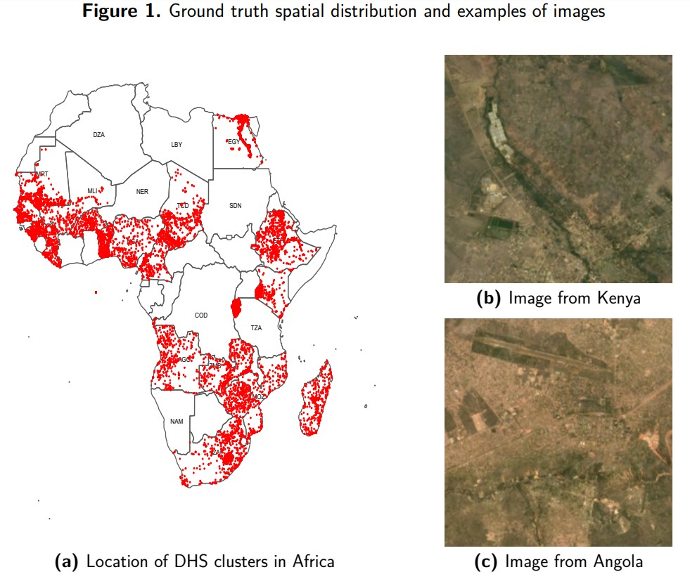
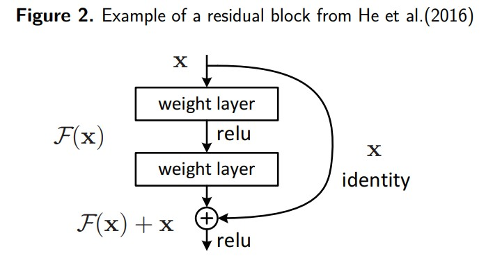
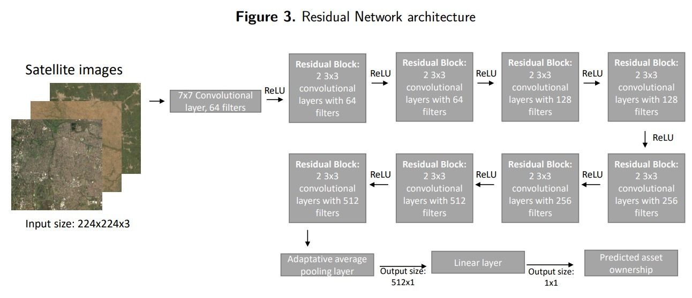
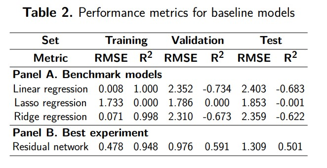
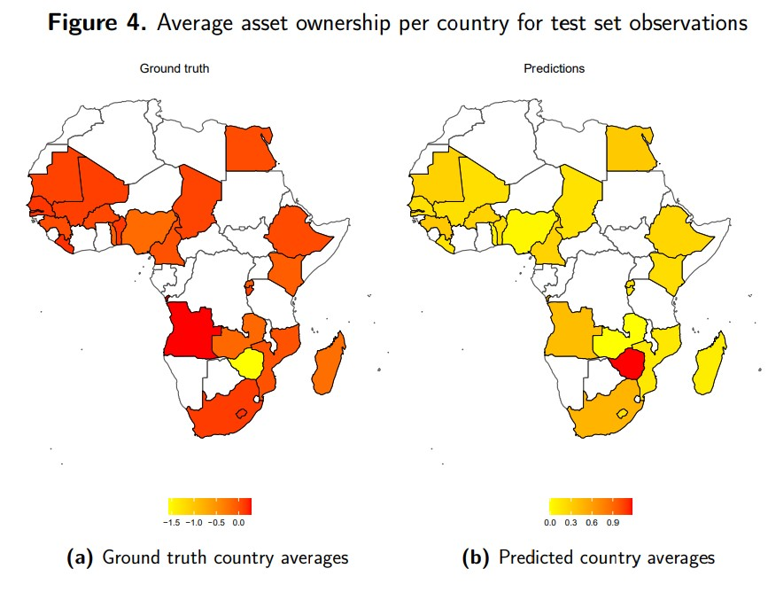

# Predicting asset ownership in Africa using satellite imagery

This was our class project for Stanford CS229 "Machine Learning" class during the Fall 2022 quarter. You can find our poster submission [here](https://nicolas-suarez.github.io/files/asset_poster.pdf).

## Introduction
We predict asset ownership in Africa making use of Landsat-8 satellite imagery and ground truth data from the Demographic and Health Surveys (DHS). We trained a ResNet-18 model} (He et al., 2016), a sub-class of a Convolutional Neural Network (CNN), and used it to predict asset ownership levels over 6.72 km by 6.72 km patches of land in Africa. We used transfer learning to train our model to perform a regression task, initializing our model with weights originally used to classify images. The performance of our best model is much better than the performance of our baseline models, but our model might be overfitting, and the predictions it generates are far off from our ground truth data. We obtained lower $R^2$ validation set values than Yeh et al. (2020), a paper that attempts our same task.

## Data
## Ground truth: Demographic and Health Surveys (DHS) surveys

- We combined all the household DHS surveys for African countries that have been published since 2014 that have a matching file with the geocoordinates of each cluster.
- Our variable of interest is the score in the wealth index obtained by each household. This score is produced using Principal Component Analysis over  survey questions, including but not limited to access to drinkable water, sewerage, electricity, and ownership of farming and non-farming assets.
- We geocoded 12,511 locations across 24 countries, combining data from 26 DHS surveys between 2014 and 2021.
- In Panel (a) of Figure 1 we show the spatial distribution of our ground truth data.

## Satellite images: Landsat-8 Surface Reflectance collection
 
 - We retrieved imagery using the Google Earth Engine API. For each DHS cluster with a geocoded location, we defined a patch of 6.72 km by 6.72 km centered in our location, and we retrieved an image for the patch using the Landsat 8 Surface Reflectance Tier 1 Collection. 
 - We used 3 bands from this collection: Red, Green and Blue surface reflectance. We preprocessed each of our images by adding a cloud mask per pixel and then computing the per pixel and band mean composite of all the available images for the year when the DHS cluster was surveyed.
 - We retrieved images for 12,426 locations across all Africa. In Figure Panels (b) and (c) of Figure 1 we show some examples of the cloud masked imagery we produced.
 - We used an 80\%, 10\%, 10\% training, validation and test data split. In the following table we show the sample sizes of our 3 sets:

| Set          | Training | Validation | Test |
|---|---|---|---|
| Observations | 9,941    | 1,243      | 1,242|

  

 

## Models
- We trained a Residual Network, a particular kind of a Convolutional Neural Network (CNN). We use transfer learning to initialize our model, and we adapt its architecture so we can use it for a regression task.
- **Residual Network (ResNet)**: Type of CNN with a special architecture defined by  He et al. (2016). These kind of models are build by stacking **Residual Blocks**, blocks of convolutional layers connected with activation functions, where the input of the block is then added to the output of the stacked convolutional layers at the end (see example in Figure 2). Residual blocks should help a deep CNN to avoid the performance problems associated with very deep networks, so if some of the final layers are not helping the model performance, their weights will be set to 0 and the block will become an identity mapping.

  

- **Our implementation**: We trained a ResNet-18 model, a Residual Network that contains 18 convolutional layers grouped in 8 residual blocks connected by ReLU activation functions. The last layer of the original model is a linear layer connected to a softmax layer that classifies images into 1,000 classes, so we modify the last linear layer so now it outputs only one number that will represent our predicted asset ownership, and we measure our loss as our root mean squared error (RMSE). We initialize our model using the original ResNet-18 pretrained weights. In Figure 3 we show our model's architecture:

  

- **Benchmark models**: We trained linear regression, Lasso regression and Ridge regression models to compare the performance of our model against them.

## Experiments

To tune the hyperparameters of our models, we experimented using data augmentation techniques and modifying several components of our model.

- **Data augmentation techniques**:
    - Applying independent vertical and horizontal flips to our images with certain probabilities.
    - Rotating our images in degrees multiples of 90 (0, 90, 180 and 270) with certain probabilities.
    - Applying different degrees of Gaussian Blurring to our images.
- **Hyperparameters tuned:**
    - Number of epochs for training.
    - Mini-batch training size.
    - Number of frozen convolutional layers at the bottom of the model (last layers of the model).
    - Optimizer (Stochastic Gradient Descent or Adam).
    - Learning rate.
    - For Stochastic Gradient Descent, we tuned the momentum parameter (momentum makes our gradient a moving average of our previous gradients).

## Results

We computed the RMSE and $R^2$ coefficient in our **training**, **validation** and **test** sets for our CNN and benchmark models.
- Linear regression and Ridge regression have good performance on the training set but a very poor performance on the validation and test sets. 
- LASSO regression performs equally bad on the training, validation and test sets.
Our best model is a **ResNet-18** model trained with: 
- 200 epochs
- Training batch size of 500 images
- 4 data augmentation transformations applied to images
- Adam optimizer
- Learning rate = 0.001
The best model has an excellent performance on the training set, and a good performance on the validation and test sets, suggesting overfitting despite using regularization techniques.

 

  

### Country average asset ownership for pixels in our test set
Our results are off from the ground truth. Most of the ground truth averages are negative, but we predict on average positive values of asset ownership.

  

## Concluding remarks and future work

- We trained a ResNet-18 model with Landsat-8 satellite imagery to predict asset ownership in Africa. We modified the original ResNet-18 architecture so we could train it for a regression task, and we used transfer learning to take advantage of the pretrained ResNet-18 weights.
- The performance of our best model is much better than the performance of our baseline models, but the model might be overfitting, and the predictions it generates are off from our ground truth data. We obtained lower $R^2$ validation set values than Yeh et al. (2020).
- Future work on this might include expanding our sample size by including more years with DHS surveys, using more channels of our satellite images, increasing the regularization in our model, adding dropout probabilities to our nodes and tuning that hyperparameter.

## Code structure
* `environment.yml` contains the environment we used to train our model.
* The `scripts` folder contains all the relevant scripts to run our code:
  * `building_dataset.R` unzips and organizes DHS data, merging datasets with their geocoded coordinates, and producing a final dataset with the asset ownership index for each location, and their coordinates. This produces the `data/ground_truth.csv` file.
  * `getting_imagery_mask_gcloud.py` takes the coordinates from each of our villages from `data/ground_truth.csv`, and uses the [Python Google Earth Engine API](https://github.com/google/earthengine-api) to download 1 year composite [Landsat 8 Surface Reflectance](https://developers.google.com/earth-engine/datasets/catalog/LANDSAT_LC08_C01_T1_SR) satellite images. These images are stored at `data/imagery/`.
  * `visualizing_imagery.py` grabs the coordinates of a location, and generates a .JPG visualization of the Landsat-8 satellite image for that location.
  * `building_pytorch_imagery.py` grabs the previously downloaded satellite images and converts them to a Pytorch Tensor. We also normalize with the ResNet-18 mean and standard deviations, and split the dataset into training, validation and test sets. This script should produce the `data/pytorch/train_set.pt`, `data/pytorch/val_set.pt` and `data/pytorch/test_set.pt` files.
  * `baseline_models.py` runs our linear regression, Ridge regression and Lasso regression baseline models, and stores their performance in our training, test and validation sets.
  * `utils.py` contains various functions we use to train our model or to preprocess data:
    * `preprocess_imagery` convert TIFF images to Numpy arrays, and also corrects images with NaN values.
    * `RegData` is a custom Dataset Class to store a dataset consisting of imagery and labels.
    * `train_model_epoch` trains our model for a full epoch, performing backward and forward propagation.
    * `validation_loop` computes the RMSE of a model in the validation set.
    * `rotation_discrete` is a custom Transform class to apply rotations to images, but only in angles that are multiples of 90 degrees.
    * `train_and_val_model` trains a model to tune its hyperparameter for an arbitrary number of epochs. It calls `train_model_epoch` and `validation_loop`.
    * `model_frozen` defines a ResNet-18 model with all the conv2d layers frozen, except for the last "n_unfreeze" layers.
    * `experiment_store` reads a dictionary with the data from our experiments, and stores that as CSV files.
    * `final_metrics_predict` is used at the end of our experimentation to compute the RMSE and R-squared of our best model in the training, validation and test sets, and to store the predictions for the test set.
  * `experiments.py` runs experiments on different Pytorch models to helps us decide how to tune the hyperparameters in our model.
  * `test_set_plot.R` produces a heatmap of the average asset ownership per country in Africa, first using the labels in our test set, and then using the predictions of our best model for those labels.
* The `data` folder contains our ground truth dataset and our results:
  * `DHS` contains our raw DHS surveys and the files containing the geocoding of the different enumeration areas.
  * `example_rgb_images` contains examples of imagery visualizations produced with `scripts/visualizing_imagery.py`.
  * `imagery` contains our satellite images.
  * `processed` contains our ground truth dataset produced by merging DHS surveys. This is generated using `scripts/building_dataset.R`. It also contains a file with our ground truth and their locations for the test set, and one extra file that adds the predictions of our best model to our ground truth test set dataset.
  * `pytorch` contains our train, test and validation datasets produced by `scripts/building_pytorch_imagery.py`. It also contains the parameters of our experiments generated by `scripts/experiments.py`.
  * `results` contains the results of our experiments, including the training and validation errors for each epoch of each experiment. It also contains the heatmaps produced by `scripts/test_set_plot.R`
